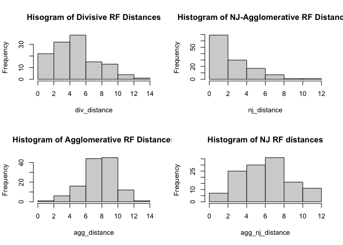
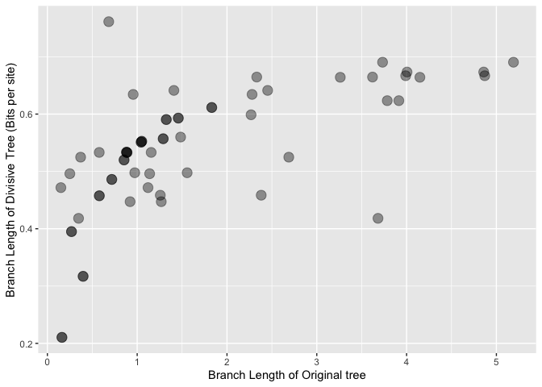
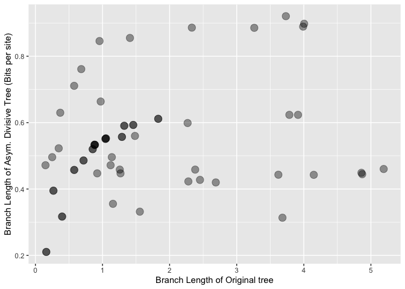
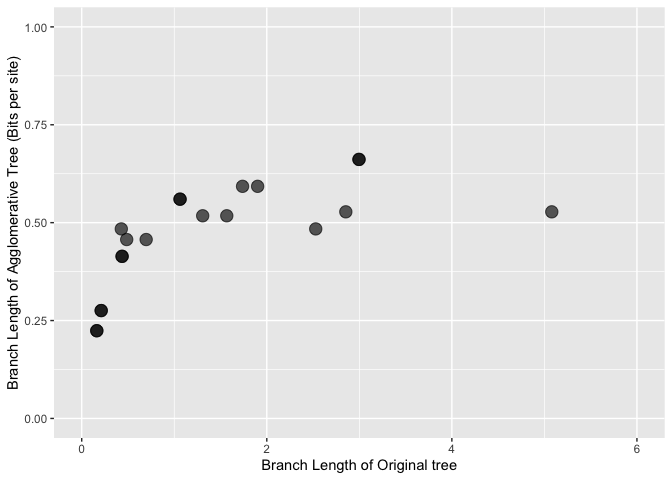
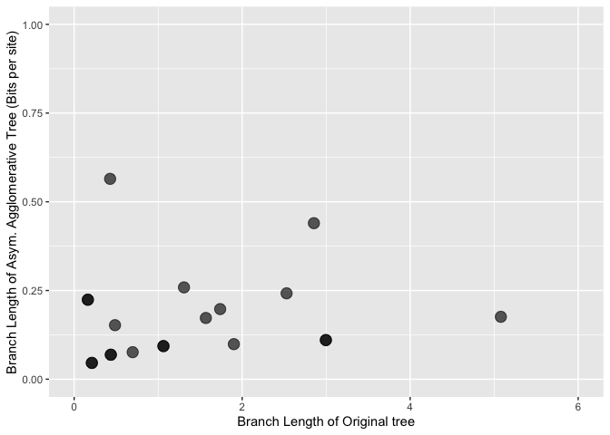
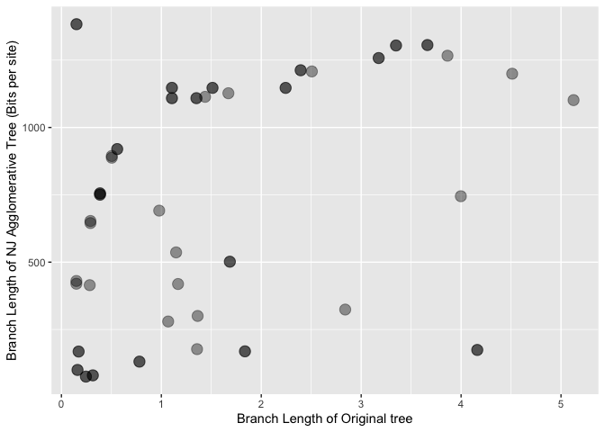

A comparative test of some information theoretic algorithms for
phylogenetic reconstruction
================

# Robinson Foulds distances

``` r
mean_div <- mean(div_distance)
mean_agg <- mean(agg_distance)
mean_agg_nj <- mean(agg_nj_distance)
mean_nj <- mean(nj_distance)
prop_div <- mean(as.numeric(div_distance) == 0)
prop_agg <- mean(as.numeric(agg_distance) == 0)
prop_agg_nj <- mean(as.numeric(agg_nj_distance) == 0)
prop_nj <- mean(as.numeric(nj_distance) == 0)

dist_data <- data.frame(Algorithm = c("Divisive","Agglomerative", "NJ Agglomerative","NJ"),
                        Mean_RF = c(mean_div, mean_agg, mean_agg_nj, mean_nj),
                        Props = c(prop_div, prop_agg, prop_agg_nj, prop_nj))
colnames(dist_data) <- c("Algorithm", "Mean RF dist.", "Prop. of RF = 0")
```

``` r
show(dist_data)
```

    ##          Algorithm Mean RF dist. Prop. of RF = 0
    ## 1         Divisive         5.648           0.024
    ## 2    Agglomerative         8.640           0.008
    ## 3 NJ Agglomerative         6.960           0.016
    ## 4               NJ         3.008           0.248

``` r
layout(matrix(c(1,2,3,4), nrow = 2, ncol = 2))
hist(div_distance, main = "Hisogram of Divisive RF Distances")
hist(agg_distance, main = "Histogram of Agglomerative RF Distances")
hist(nj_distance, main = "Histogram of NJ-Agglomerative RF Distances")
hist(agg_nj_distance, main = "Histogram of NJ RF distances")
```

<!-- -->

# Branch Length Comparisons

1.  Divisive Trees

``` r
div_ids <- which(div_distance == 0)

# original_lengths <-read.tree(text = trees[[div_ids[1]]])$edge.length
#   d_lengths <- read.tree(text = data$Divisive[div_ids[1]])$edge.length
#   plot(original_lengths, d_lengths)
  
og_tree <- read.tree(text = trees[[div_ids[1]]])
div_tree <- read.tree(text = data$Divisive[div_ids[1]])
og_tree_root <- og_tree$edge[which(og_tree$edge[,2] == which(og_tree$tip.label == "S1")),1]
div_tree_root <- div_tree$edge[which(div_tree$edge[,2] == which(div_tree$tip.label == "S1")),1]
og_tree_rerooted <- root(og_tree, node = og_tree_root)
div_tree_rerooted <- root(div_tree, node = div_tree_root)
div_dist_corr <- data.frame(Originals = ladderize(og_tree_rerooted)$edge.length, 
                        Divisive = ladderize(div_tree_rerooted)$edge.length)

for(i in div_ids[-1]){
   og_tree <- read.tree(text = trees[[i]])
div_tree <- read.tree(text = data$Divisive[i])
og_tree_root <- og_tree$edge[which(og_tree$edge[,2] == which(og_tree$tip.label == "S1")),1]
div_tree_root <- div_tree$edge[which(div_tree$edge[,2] == which(div_tree$tip.label == "S1")),1]
og_tree_rerooted <- root(og_tree, node = og_tree_root)
div_tree_rerooted <- root(div_tree, node = div_tree_root)
div_dist_corr <- rbind(div_dist_corr, 
                   cbind(Originals = ladderize(og_tree_rerooted)$edge.length, Divisive = ladderize(div_tree_rerooted)$edge.length))
}
```

``` r
ggplot(div_dist_corr, aes(x=Originals, y=Divisive))+
  geom_point(size = 4, alpha = 0.4) + 
  #xlim(c(0,6)) + 
  #ylim(c(0,1.0)) + 
  xlab("Branch Length of Original tree") + 
  ylab("Branch Length of Divisive Tree (Bits per site)")
```

<!-- -->

``` r
  #geom_smooth()
```

## Asymmetric Divisive Trees

``` r
div_ids <- which(div_distance == 0)

# original_lengths <-read.tree(text = trees[[div_ids[1]]])$edge.length
#   d_lengths <- read.tree(text = data$Divisive_Asym[div_ids[1]])$edge.length
#   plot(original_lengths, d_lengths)
  
og_tree <- read.tree(text = trees[[div_ids[1]]])
div_tree <- read.tree(text = data$Divisive_Asym[div_ids[1]])
og_tree_root <- og_tree$edge[which(og_tree$edge[,2] == which(og_tree$tip.label == "S1")),1]
div_tree_root <- div_tree$edge[which(div_tree$edge[,2] == which(div_tree$tip.label == "S1")),1]
og_tree_rerooted <- root(og_tree, node = og_tree_root)
div_tree_rerooted <- root(div_tree, node = div_tree_root)
div_dist_corr <- data.frame(Originals = ladderize(og_tree_rerooted)$edge.length, 
                        Divisive = ladderize(div_tree_rerooted)$edge.length)

for(i in div_ids[-1]){
   og_tree <- read.tree(text = trees[[i]])
div_tree <- read.tree(text = data$Divisive_Asym[i])
og_tree_root <- og_tree$edge[which(og_tree$edge[,2] == which(og_tree$tip.label == "S1")),1]
div_tree_root <- div_tree$edge[which(div_tree$edge[,2] == which(div_tree$tip.label == "S1")),1]
og_tree_rerooted <- root(og_tree, node = og_tree_root)
div_tree_rerooted <- root(div_tree, node = div_tree_root)
div_dist_corr <- rbind(div_dist_corr, 
                   cbind(Originals = ladderize(og_tree_rerooted)$edge.length, Divisive = ladderize(div_tree_rerooted)$edge.length))
}
```

``` r
ggplot(div_dist_corr, aes(x=Originals, y=Divisive))+
  geom_point(size = 4, alpha = 0.4) + 
  #xlim(c(0,6)) + 
  #ylim(c(0,1.0)) + 
  xlab("Branch Length of Original tree") + 
  ylab("Branch Length of Asym. Divisive Tree (Bits per site)")
```

<!-- -->

``` r
  #geom_smooth()
```

2.  Agglomerative Trees

## Symmetric Agglomerative Trees

``` r
agg_ids <- which(agg_distance == 0)

# original_lengths <-read.tree(text = trees[[agg_ids[1]]])$edge.length
#   d_lengths <- read.tree(text = data$agglomerative[agg_ids[1]])$edge.length
#   plot(original_lengths, d_lengths)
  
og_tree <- read.tree(text = trees[[agg_ids[1]]])
agg_tree <- read.tree(text = data$Agglomerative[agg_ids[1]])
og_tree_root <- og_tree$edge[which(og_tree$edge[,2] == which(og_tree$tip.label == "S1")),1]
agg_tree_root <- agg_tree$edge[which(agg_tree$edge[,2] == which(agg_tree$tip.label == "S1")),1]
og_tree_rerooted <- root(og_tree, node = og_tree_root)
agg_tree_rerooted <- root(agg_tree, node = agg_tree_root)
agg_dist_corr <- data.frame(Originals = ladderize(og_tree_rerooted)$edge.length, 
                        agglomerative = ladderize(agg_tree_rerooted)$edge.length)

for(i in agg_ids){
   og_tree <- read.tree(text = trees[[i]])
agg_tree <- read.tree(text = data$Agglomerative[i])
og_tree_root <- og_tree$edge[which(og_tree$edge[,2] == which(og_tree$tip.label == "S1")),1]
agg_tree_root <- agg_tree$edge[which(agg_tree$edge[,2] == which(agg_tree$tip.label == "S1")),1]
og_tree_rerooted <- root(og_tree, node = og_tree_root)
agg_tree_rerooted <- root(agg_tree, node = agg_tree_root)
agg_dist_corr <- rbind(agg_dist_corr, 
                   cbind(Originals = ladderize(og_tree_rerooted)$edge.length, agglomerative = ladderize(agg_tree_rerooted)$edge.length))
}
```

``` r
ggplot(agg_dist_corr, aes(x=Originals, y=agglomerative))+
  geom_point(size = 4, alpha = 0.4) + 
  xlim(c(0,6)) + 
  ylim(c(0,1.0)) + 
  xlab("Branch Length of Original tree") + 
  ylab("Branch Length of Agglomerative Tree (Bits per site)")
```

    ## Warning: Removed 2 rows containing missing values (geom_point).

<!-- -->

``` r
agg_ids <- which(agg_distance == 0)

# original_lengths <-read.tree(text = trees[[agg_ids[1]]])$edge.length
#   d_lengths <- read.tree(text = data$Agglomerative_Asym[agg_ids[1]])$edge.length
#   plot(original_lengths, d_lengths)
  
og_tree <- read.tree(text = trees[[agg_ids[1]]])
agg_tree <- read.tree(text = data$Agglomerative_Asym[agg_ids[1]])
og_tree_root <- og_tree$edge[which(og_tree$edge[,2] == which(og_tree$tip.label == "S1")),1]
agg_tree_root <- agg_tree$edge[which(agg_tree$edge[,2] == which(agg_tree$tip.label == "S1")),1]
og_tree_rerooted <- root(og_tree, node = og_tree_root)
agg_tree_rerooted <- root(agg_tree, node = agg_tree_root)
agg_dist_corr <- data.frame(Originals = ladderize(og_tree_rerooted)$edge.length, 
                        agglomerative = ladderize(agg_tree_rerooted)$edge.length)

for(i in agg_ids){
   og_tree <- read.tree(text = trees[[i]])
agg_tree <- read.tree(text = data$Agglomerative_Asym[i])
og_tree_root <- og_tree$edge[which(og_tree$edge[,2] == which(og_tree$tip.label == "S1")),1]
agg_tree_root <- agg_tree$edge[which(agg_tree$edge[,2] == which(agg_tree$tip.label == "S1")),1]
og_tree_rerooted <- root(og_tree, node = og_tree_root)
agg_tree_rerooted <- root(agg_tree, node = agg_tree_root)
agg_dist_corr <- rbind(agg_dist_corr, 
                   cbind(Originals = ladderize(og_tree_rerooted)$edge.length, agglomerative = ladderize(agg_tree_rerooted)$edge.length))
}
```

``` r
ggplot(agg_dist_corr, aes(x=Originals, y=agglomerative))+
  geom_point(size = 4, alpha = 0.4) + 
  xlim(c(0,6)) + 
  ylim(c(0,1.0)) + 
  xlab("Branch Length of Original tree") + 
  ylab("Branch Length of Asym. Agglomerative Tree (Bits per site)")
```

    ## Warning: Removed 2 rows containing missing values (geom_point).

<!-- -->

## Neighbour-Joining agglomerative tree

``` r
agg_ids <- which(agg_nj_distance == 0)

# original_lengths <-read.tree(text = trees[[agg_ids[1]]])$edge.length
#   d_lengths <- read.tree(text = data$Agglomerative_NJ[agg_ids[1]])$edge.length
#   plot(original_lengths, d_lengths)
  
og_tree <- read.tree(text = trees[[agg_ids[1]]])
agg_tree <- read.tree(text = data$Agglomerative_NJ[agg_ids[1]])
og_tree_root <- og_tree$edge[which(og_tree$edge[,2] == which(og_tree$tip.label == "S1")),1]
agg_tree_root <- agg_tree$edge[which(agg_tree$edge[,2] == which(agg_tree$tip.label == "S1")),1]
og_tree_rerooted <- root(og_tree, node = og_tree_root)
agg_tree_rerooted <- root(agg_tree, node = agg_tree_root)
agg_dist_corr <- data.frame(Originals = ladderize(og_tree_rerooted)$edge.length, 
                        agglomerative = ladderize(agg_tree_rerooted)$edge.length)

for(i in agg_ids){
   og_tree <- read.tree(text = trees[[i]])
agg_tree <- read.tree(text = data$Agglomerative_NJ[i])
og_tree_root <- og_tree$edge[which(og_tree$edge[,2] == which(og_tree$tip.label == "S1")),1]
agg_tree_root <- agg_tree$edge[which(agg_tree$edge[,2] == which(agg_tree$tip.label == "S1")),1]
og_tree_rerooted <- root(og_tree, node = og_tree_root)
agg_tree_rerooted <- root(agg_tree, node = agg_tree_root)
agg_dist_corr <- rbind(agg_dist_corr, 
                   cbind(Originals = ladderize(og_tree_rerooted)$edge.length, agglomerative = ladderize(agg_tree_rerooted)$edge.length))
}
```

``` r
ggplot(agg_dist_corr, aes(x=Originals, y=agglomerative))+
  geom_point(size = 4, alpha = 0.4) + 
  #xlim(c(0,6)) + 
  #ylim(c(0,1.0)) + 
  xlab("Branch Length of Original tree") + 
  ylab("Branch Length of NJ Agglomerative Tree (Bits per site)")
```

<!-- -->

3.  Tree properties (ultrametricity, additivity, rooting accuracy)

``` r
div_root  <- mapply(all.equal,
       lapply(data$Original, function(x) read.tree(text = as.character(x))),
       lapply(data$Divisive, function(x) read.tree(text = as.character(x))),
       use.edge.length = FALSE) %>% as.numeric %>% mean
div_asym_root <- mapply(all.equal,
       lapply(data$Original, function(x) read.tree(text = as.character(x))),
       lapply(data$Divisive, function(x) read.tree(text = as.character(x))),
       use.edge.length = FALSE) %>% as.numeric %>% mean
agg_root <- mapply(all.equal,
       lapply(data$Original, function(x) read.tree(text = as.character(x))),
       lapply(data$Agglomerative, function(x) read.tree(text = as.character(x))),
       use.edge.length = FALSE) %>% as.numeric %>% mean
agg_asym_root <- mapply(all.equal,
       lapply(data$Original, function(x) read.tree(text = as.character(x))),
       lapply(data$Agglomerative_Asym, function(x) read.tree(text = as.character(x))),
       use.edge.length = FALSE) %>% as.numeric %>% mean
agg_nj_root <- mapply(all.equal,
       lapply(data$Original, function(x) read.tree(text = as.character(x))),
       lapply(data$Agglomerative_NJ, function(x) read.tree(text = as.character(x))),
       use.edge.length = FALSE) %>% as.numeric %>% mean
nj_root <- mapply(all.equal,
       lapply(data$Original, function(x) read.tree(text = as.character(x))),
       lapply(data$NJ, function(x) read.tree(text = as.character(x))),
       use.edge.length = FALSE) %>% as.numeric %>% mean
rooting <- c(1, agg_root, agg_asym_root, agg_nj_root, div_root, div_asym_root, nj_root)
```

``` r
og_metricity <- data$Original %>%
                lapply(function(x) read.tree(text = as.character(x))) %>%
                lapply(function(x) is.ultrametric(x, tol = 1e-06)) %>% as.numeric %>% mean

div_metricity <- data$Divisive %>%
                lapply(function(x) read.tree(text = as.character(x))) %>%
                lapply(function(x) is.ultrametric(x, tol = 1e-06)) %>% as.numeric %>% mean
div_asym_metricity <- data$Divisive_Asym %>%
                lapply(function(x) read.tree(text = as.character(x))) %>%
                lapply(function(x) is.ultrametric(x, tol = 1e-06)) %>% as.numeric %>% mean
agg_metricity <- data$Agglomerative %>%
                lapply(function(x) read.tree(text = as.character(x))) %>%
                lapply(function(x) is.ultrametric(x, tol = 1e-06)) %>% as.numeric %>% mean
agg_asym_metricity <- data$Agglomerative_Asym %>%
                lapply(function(x) read.tree(text = as.character(x))) %>%
                lapply(function(x) is.ultrametric(x, tol = 1e-06)) %>% as.numeric %>% mean
agg_nj_metricity <- data$Agglomerative_NJ %>%
                lapply(function(x) read.tree(text = as.character(x))) %>%
                lapply(function(x) is.ultrametric(x, tol = 1e-06)) %>% as.numeric %>% mean
nj_metricity <- data$NJ %>%
                lapply(function(x) read.tree(text = as.character(x))) %>%
                lapply(function(x) is.ultrametric(x, tol = 1e-06)) %>% as.numeric %>% mean

metricity <- c(1, agg_metricity, agg_asym_metricity, agg_nj_metricity, div_metricity, div_asym_metricity, nj_metricity)
```

``` r
og_additivity <- data$Original %>%
                lapply(function(x) read.tree(text = as.character(x))) %>%
                lapply(is_additive) %>% as.numeric %>% mean
div_additivity <- data$Divisive %>%
                lapply(function(x) read.tree(text = as.character(x))) %>%
                lapply(is_additive) %>% as.numeric %>% mean
div_asym_additivity <- data$Divisive_Asym %>%
                lapply(function(x) read.tree(text = as.character(x))) %>%
                lapply(is_additive) %>% as.numeric %>% mean
agg_additivity <- data$Agglomerative %>%
                lapply(function(x) read.tree(text = as.character(x))) %>%
                lapply(is_additive) %>% as.numeric %>% mean
agg_asym_additivity <- data$Agglomerative_Asym %>%
                lapply(function(x) read.tree(text = as.character(x))) %>%
                lapply(is_additive) %>% as.numeric %>% mean
agg_nj_additivity <- data$Agglomerative_NJ %>%
                lapply(function(x) read.tree(text = as.character(x))) %>%
                lapply(is_additive) %>% as.numeric %>% mean
nj_additivity <- data$NJ %>%
                lapply(function(x) read.tree(text = as.character(x))) %>%
                lapply(is_additive) %>% as.numeric %>% mean

additivity <- c(1, agg_additivity, agg_asym_additivity, agg_nj_additivity, div_additivity, div_asym_additivity, nj_additivity)
```

``` r
Tree_data <- data.frame(Algorithm = c("Original","Agglomerative", "Asymmetric Agglomerative","NJ Agglomerative", "Divisive", "Asymmetric Divisive", "NJ"),
                        Rooting = rooting,
                        Ultrametricity = metricity, 
                        Additivity = additivity)
```

``` r
print(Tree_data)
```

    ##                  Algorithm Rooting Ultrametricity Additivity
    ## 1                 Original       1              1          1
    ## 2            Agglomerative       0              0          1
    ## 3 Asymmetric Agglomerative       0              0          1
    ## 4         NJ Agglomerative       0              0          1
    ## 5                 Divisive       0              0          1
    ## 6      Asymmetric Divisive       0              0          1
    ## 7                       NJ       0              0          1
