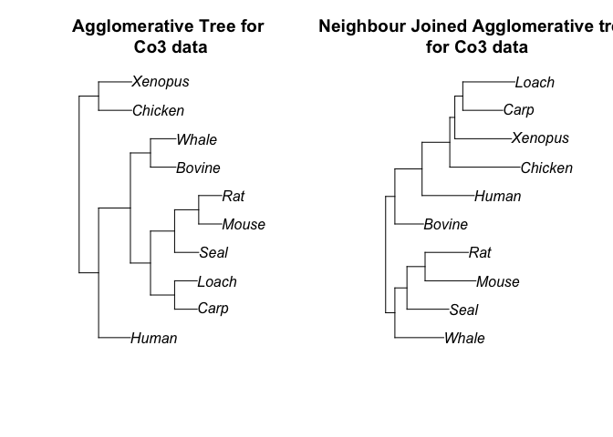

Information theoretic agglomerative clustering
================

Let’s write the variation of information as  = 2H(X,Y) - H(X) + H(Y)"). We then approximate it through its
“algorithmic” counterpart:  \\approx 2H(X \\cup Y) - H(X) - H(Y)") Then the agglomerative
algorithm based on Press et al. is as follows:

1.  Maintain an active `char` list `forests` denoting tips of the tree
2.  Parse through `forests` and find the two closest clusters
3.  Update `forest` by merging the two clusters via tree joining `t1 +
    t2`.

Moreover, when two forests  and  are joined
into ")
the branch length from the node to each tip
 and
 is taken to be "). We write it up as follows:

``` r
agg_clustering <- function(sequence) {
  #inputs:
  # sequence -- aligned dna sequence in phyDat
  #ouput:
  # tree in newick format
  tips <- rownames(sequence)
  forests <- make_newick(tips)
  
  if (length(forests) == 1) {
    # Just one species
    tree_string <- forests[1]
  } else if (length(forests) == 2) {
    # Just two species
    # tree_string <-
    #   make_newick(paste(forests[1], ",", forests[2], sep = ""))
    branch <- alg_info(sequence, tips[1], tips[2])
    tree_string <- paste("(", tips[1], ":", branch/2, ", ", tips[2], ":", branch/2, ")", sep = "")
  } else{
    #More than two species
    
    end <- length(forests) - 2
    for (i in c(1:end)) {
      #Do this subroutine n-2 times!
      
      x_names <-
        read.tree(text = paste(forests[1], ";", sep = ""))$tip.label
      y_names <-
        read.tree(text = paste(forests[2], ";", sep = ""))$tip.label
      #print(x_names)
      #print(y_names)
      
      # max_dist <-
      #   alg_info(matrix(sequence[x_names, ], nrow = length(x_names)),
      #            matrix(sequence[y_names, ], nrow = length(y_names)))
      max_dist <- alg_info(sequence, x_names, y_names)
      max_pair <- c(1, 2)
      
      #Subroutine for computing the closest two clusters
      
      for (k in 1:(length(forests) - 1)) {
        for (j in (k + 1):length(forests)) {
          x_names <- read.tree(text = paste(forests[k], ";", sep = ""))$tip.label
          y_names <- read.tree(text = paste(forests[j], ";", sep = ""))$tip.label
          # dist <-
          #   alg_info(matrix(sequence[x_names, ], nrow = length(y_names)))
          dist <- alg_info(sequence, x_names, y_names)
          cat("Current pair: ", x_names, "/", y_names, "; IG =", dist,"\n")
          if (dist < max_dist) {
            max_dist <- dist
            max_pair <- c(k, j)
          }
        }
      }
      
      # dist <- function(x,y){
      #   x_names <- read.tree(text = paste(x, ";", sep = ""))$tip.label
      #   y_names <- read.tree(text = paste(y, ";", sep = ""))$tip.label
      #   return(alg_info(sequence, x_names, y_names))
      # }
      # dist_v <- Vectorize(dist)
      # dist_matrix <- outer(forests, forests, dist_v)
      # dist_matrix <- map2_dbl(.x = forests, .y = forests, .f = dist)
      # diag(dist_matrix) <- NA
      # 
      # max_pair <- arrayInd(which.min(dist_matrix), dim(dist_matrix))
      # max_dist <- dist_matrix[max_pair]
      # print(max_pair)
      
      #Subroutine for joining the two forests
      new_branch <- paste("(", forests[max_pair[1]], ",", forests[max_pair[2]], ")", sep = "")
      forests <- forests[-max_pair]
      forests <- c(forests, new_branch)
      new_tip <- paste("(", tips[max_pair[1]], ":", max_dist/2, ",", tips[max_pair[2]], ":", max_dist/2, ")", sep = "")
      #print(new_tip)
      tips <- tips[-max_pair]
      tips <- c(tips, new_tip)
    }
    
    x_names <- read.tree(text = paste(forests[1], ";", sep = ""))$tip.label
    y_names <- read.tree(text = paste(forests[2], ";", sep = ""))$tip.label
    branch <- alg_info(sequence, x_names, y_names)
    tree_string <- paste("(", tips[1], ":", branch/2, ",", tips[2], ":", branch/2, ")", sep = "")
  }
  #print(tree_string)
  return(tree_string)
}
```

Now let’s see how it performs on the Co3 dataset from Cummings et al:

``` r
sequence <- ReadCharacters("coiii.nex")
rownames(sequence) <- names(as.DNAbin(read.nexus.data("coiii.nex")))
```

``` r
plot(read.tree(text = paste(agg_clustering(sequence), ";", sep="")))
```

    ## Current pair:  Bovine / Carp ; IG = 386 
    ## Current pair:  Bovine / Chicken ; IG = 444 
    ## Current pair:  Bovine / Human ; IG = 330 
    ## Current pair:  Bovine / Loach ; IG = 424 
    ## Current pair:  Bovine / Mouse ; IG = 368 
    ## Current pair:  Bovine / Rat ; IG = 342 
    ## Current pair:  Bovine / Seal ; IG = 312 
    ## Current pair:  Bovine / Whale ; IG = 306 
    ## Current pair:  Bovine / Xenopus ; IG = 426 
    ## Current pair:  Carp / Chicken ; IG = 374 
    ## Current pair:  Carp / Human ; IG = 378 
    ## Current pair:  Carp / Loach ; IG = 272 
    ## Current pair:  Carp / Mouse ; IG = 348 
    ## Current pair:  Carp / Rat ; IG = 384 
    ## Current pair:  Carp / Seal ; IG = 386 
    ## Current pair:  Carp / Whale ; IG = 410 
    ## Current pair:  Carp / Xenopus ; IG = 320 
    ## Current pair:  Chicken / Human ; IG = 446 
    ## Current pair:  Chicken / Loach ; IG = 382 
    ## Current pair:  Chicken / Mouse ; IG = 438 
    ## Current pair:  Chicken / Rat ; IG = 418 
    ## Current pair:  Chicken / Seal ; IG = 438 
    ## Current pair:  Chicken / Whale ; IG = 418 
    ## Current pair:  Chicken / Xenopus ; IG = 398 
    ## Current pair:  Human / Loach ; IG = 434 
    ## Current pair:  Human / Mouse ; IG = 376 
    ## Current pair:  Human / Rat ; IG = 340 
    ## Current pair:  Human / Seal ; IG = 342 
    ## Current pair:  Human / Whale ; IG = 348 
    ## Current pair:  Human / Xenopus ; IG = 414 
    ## Current pair:  Loach / Mouse ; IG = 414 
    ## Current pair:  Loach / Rat ; IG = 424 
    ## Current pair:  Loach / Seal ; IG = 438 
    ## Current pair:  Loach / Whale ; IG = 424 
    ## Current pair:  Loach / Xenopus ; IG = 334 
    ## Current pair:  Mouse / Rat ; IG = 278 
    ## Current pair:  Mouse / Seal ; IG = 320 
    ## Current pair:  Mouse / Whale ; IG = 394 
    ## Current pair:  Mouse / Xenopus ; IG = 394 
    ## Current pair:  Rat / Seal ; IG = 312 
    ## Current pair:  Rat / Whale ; IG = 356 
    ## Current pair:  Rat / Xenopus ; IG = 390 
    ## Current pair:  Seal / Whale ; IG = 302 
    ## Current pair:  Seal / Xenopus ; IG = 416 
    ## Current pair:  Whale / Xenopus ; IG = 420 
    ## Current pair:  Bovine / Chicken ; IG = 444 
    ## Current pair:  Bovine / Human ; IG = 330 
    ## Current pair:  Bovine / Mouse ; IG = 368 
    ## Current pair:  Bovine / Rat ; IG = 342 
    ## Current pair:  Bovine / Seal ; IG = 312 
    ## Current pair:  Bovine / Whale ; IG = 306 
    ## Current pair:  Bovine / Xenopus ; IG = 426 
    ## Current pair:  Bovine / Carp Loach ; IG = 373.6642 
    ## Current pair:  Chicken / Human ; IG = 446 
    ## Current pair:  Chicken / Mouse ; IG = 438 
    ## Current pair:  Chicken / Rat ; IG = 418 
    ## Current pair:  Chicken / Seal ; IG = 438 
    ## Current pair:  Chicken / Whale ; IG = 418 
    ## Current pair:  Chicken / Xenopus ; IG = 398 
    ## Current pair:  Chicken / Carp Loach ; IG = 348.4552 
    ## Current pair:  Human / Mouse ; IG = 376 
    ## Current pair:  Human / Rat ; IG = 340 
    ## Current pair:  Human / Seal ; IG = 342 
    ## Current pair:  Human / Whale ; IG = 348 
    ## Current pair:  Human / Xenopus ; IG = 414 
    ## Current pair:  Human / Carp Loach ; IG = 374.9975 
    ## Current pair:  Mouse / Rat ; IG = 278 
    ## Current pair:  Mouse / Seal ; IG = 320 
    ## Current pair:  Mouse / Whale ; IG = 394 
    ## Current pair:  Mouse / Xenopus ; IG = 394 
    ## Current pair:  Mouse / Carp Loach ; IG = 352.4552 
    ## Current pair:  Rat / Seal ; IG = 312 
    ## Current pair:  Rat / Whale ; IG = 356 
    ## Current pair:  Rat / Xenopus ; IG = 390 
    ## Current pair:  Rat / Carp Loach ; IG = 375.6512 
    ## Current pair:  Seal / Whale ; IG = 302 
    ## Current pair:  Seal / Xenopus ; IG = 416 
    ## Current pair:  Seal / Carp Loach ; IG = 382.1675 
    ## Current pair:  Whale / Xenopus ; IG = 420 
    ## Current pair:  Whale / Carp Loach ; IG = 386.3439 
    ## Current pair:  Xenopus / Carp Loach ; IG = 302.0371 
    ## Current pair:  Bovine / Chicken ; IG = 444 
    ## Current pair:  Bovine / Human ; IG = 330 
    ## Current pair:  Bovine / Seal ; IG = 312 
    ## Current pair:  Bovine / Whale ; IG = 306 
    ## Current pair:  Bovine / Xenopus ; IG = 426 
    ## Current pair:  Bovine / Carp Loach ; IG = 373.6642 
    ## Current pair:  Bovine / Mouse Rat ; IG = 326.2592 
    ## Current pair:  Chicken / Human ; IG = 446 
    ## Current pair:  Chicken / Seal ; IG = 438 
    ## Current pair:  Chicken / Whale ; IG = 418 
    ## Current pair:  Chicken / Xenopus ; IG = 398 
    ## Current pair:  Chicken / Carp Loach ; IG = 348.4552 
    ## Current pair:  Chicken / Mouse Rat ; IG = 397.8602 
    ## Current pair:  Human / Seal ; IG = 342 
    ## Current pair:  Human / Whale ; IG = 348 
    ## Current pair:  Human / Xenopus ; IG = 414 
    ## Current pair:  Human / Carp Loach ; IG = 374.9975 
    ## Current pair:  Human / Mouse Rat ; IG = 328.599 
    ## Current pair:  Seal / Whale ; IG = 302 
    ## Current pair:  Seal / Xenopus ; IG = 416 
    ## Current pair:  Seal / Carp Loach ; IG = 382.1675 
    ## Current pair:  Seal / Mouse Rat ; IG = 290.0306 
    ## Current pair:  Whale / Xenopus ; IG = 420 
    ## Current pair:  Whale / Carp Loach ; IG = 386.3439 
    ## Current pair:  Whale / Mouse Rat ; IG = 347.9454 
    ## Current pair:  Xenopus / Carp Loach ; IG = 302.0371 
    ## Current pair:  Xenopus / Mouse Rat ; IG = 363.9715 
    ## Current pair:  Carp Loach / Mouse Rat ; IG = 306.1037 
    ## Current pair:  Bovine / Chicken ; IG = 444 
    ## Current pair:  Bovine / Human ; IG = 330 
    ## Current pair:  Bovine / Whale ; IG = 306 
    ## Current pair:  Bovine / Xenopus ; IG = 426 
    ## Current pair:  Bovine / Carp Loach ; IG = 373.6642 
    ## Current pair:  Bovine / Seal Mouse Rat ; IG = 313.5689 
    ## Current pair:  Chicken / Human ; IG = 446 
    ## Current pair:  Chicken / Whale ; IG = 418 
    ## Current pair:  Chicken / Xenopus ; IG = 398 
    ## Current pair:  Chicken / Carp Loach ; IG = 348.4552 
    ## Current pair:  Chicken / Seal Mouse Rat ; IG = 390.9614 
    ## Current pair:  Human / Whale ; IG = 348 
    ## Current pair:  Human / Xenopus ; IG = 414 
    ## Current pair:  Human / Carp Loach ; IG = 374.9975 
    ## Current pair:  Human / Seal Mouse Rat ; IG = 325.623 
    ## Current pair:  Whale / Xenopus ; IG = 420 
    ## Current pair:  Whale / Carp Loach ; IG = 386.3439 
    ## Current pair:  Whale / Seal Mouse Rat ; IG = 321.7208 
    ## Current pair:  Xenopus / Carp Loach ; IG = 302.0371 
    ## Current pair:  Xenopus / Seal Mouse Rat ; IG = 367.0741 
    ## Current pair:  Carp Loach / Seal Mouse Rat ; IG = 289.9212 
    ## Current pair:  Bovine / Chicken ; IG = 444 
    ## Current pair:  Bovine / Human ; IG = 330 
    ## Current pair:  Bovine / Whale ; IG = 306 
    ## Current pair:  Bovine / Xenopus ; IG = 426 
    ## Current pair:  Bovine / Carp Loach Seal Mouse Rat ; IG = 362.819 
    ## Current pair:  Chicken / Human ; IG = 446 
    ## Current pair:  Chicken / Whale ; IG = 418 
    ## Current pair:  Chicken / Xenopus ; IG = 398 
    ## Current pair:  Chicken / Carp Loach Seal Mouse Rat ; IG = 388.0213 
    ## Current pair:  Human / Whale ; IG = 348 
    ## Current pair:  Human / Xenopus ; IG = 414 
    ## Current pair:  Human / Carp Loach Seal Mouse Rat ; IG = 369.3448 
    ## Current pair:  Whale / Xenopus ; IG = 420 
    ## Current pair:  Whale / Carp Loach Seal Mouse Rat ; IG = 371.458 
    ## Current pair:  Xenopus / Carp Loach Seal Mouse Rat ; IG = 367.6684 
    ## Current pair:  Chicken / Human ; IG = 446 
    ## Current pair:  Chicken / Xenopus ; IG = 398 
    ## Current pair:  Chicken / Carp Loach Seal Mouse Rat ; IG = 388.0213 
    ## Current pair:  Chicken / Bovine Whale ; IG = 399.0562 
    ## Current pair:  Human / Xenopus ; IG = 414 
    ## Current pair:  Human / Carp Loach Seal Mouse Rat ; IG = 369.3448 
    ## Current pair:  Human / Bovine Whale ; IG = 316.2331 
    ## Current pair:  Xenopus / Carp Loach Seal Mouse Rat ; IG = 367.6684 
    ## Current pair:  Xenopus / Bovine Whale ; IG = 392.5399 
    ## Current pair:  Carp Loach Seal Mouse Rat / Bovine Whale ; IG = 241.6925 
    ## Current pair:  Chicken / Human ; IG = 446 
    ## Current pair:  Chicken / Xenopus ; IG = 398 
    ## Current pair:  Chicken / Carp Loach Seal Mouse Rat Bovine Whale ; IG = 404.5594 
    ## Current pair:  Human / Xenopus ; IG = 414 
    ## Current pair:  Human / Carp Loach Seal Mouse Rat Bovine Whale ; IG = 382.6071 
    ## Current pair:  Xenopus / Carp Loach Seal Mouse Rat Bovine Whale ; IG = 391.1861 
    ## Current pair:  Chicken / Xenopus ; IG = 398 
    ## Current pair:  Chicken / Human Carp Loach Seal Mouse Rat Bovine Whale ; IG = 411.9858 
    ## Current pair:  Xenopus / Human Carp Loach Seal Mouse Rat Bovine Whale ; IG = 399.762

<!-- -->

# Other agglomerative methods

We’ll use the ones shown in APER

1.  UPGMA

<!-- end list -->

``` r
trials <- as.DNAbin.character(sequence, all = TRUE)
M <- dist.dna(trials)
```

``` r
plot(upgma(M)); axisPhylo()
```

<!-- -->

2.  Neighbour joining

<!-- end list -->

``` r
plot(nj(M)); axisPhylo()
```

<!-- -->
