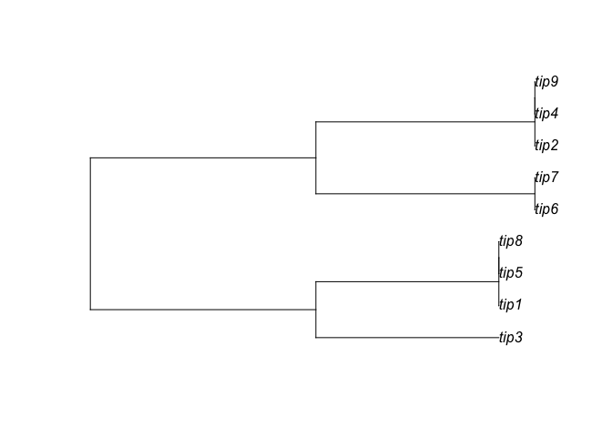

Information gain model for trees
================
14/06/2021

# Introduction

Let  be a set of
OTU’s and let
") be
a binary tree associated with
. If

then the number of bifurcations in
")
is  so the task is
to figure out the bifurcations of
")
(or more directly, figure out a set of sensible bifurcations
 to make a tree
with

as tips or leaves).

The information gain model of computing bifurcations/splits/partitions
is as follows: Let

be a partition of
. If
 are realizations
of a random variable
 and
 are realizations
of a random variable
, then
 is the set of
realizations of a random variable

where
 = p")
and
 = 1-p").
The information gain of

is then

 = H(Y) - H(X_\eta \mid \eta) = H(Y) - pH(X_1) - (1-p)H(X_2) \approx H(x_0) - \frac{x_1}{x_0}H(X_1) - \frac{x_2}{x_0}H(X_2)
\end{equation}")

We pick the partition

that maximizes the information gain on the data
.

This strategy of picking the information gain-maximizing partition
closely follows decision tree learning in binary classification, where
at each node the data is classified according to the labels of the
information gain maximizing feature. In such a case the split at a node
is induced by the labels of the optimal feature
").
Of course, in our case, when each OTU is represented by a nucleotide (or
codon) sequence, we assume that we don’t have feature-level binary data
so we search over all partitions of
 instead.
Moreover, this strategy of making a tree is divisive or “top-down”: at
each stage we take data
 and split it
into two clusters
 and
. We obtain a
tree by repeating this splitting process on
 and
 recursively. In
summary the algorithm is as follows:

    ALGORITHM infotree

    1. Start with data $x_0$
    2. If $x_0$ has one or two species, return the trees (OTU 1) or (OTU 1, OTU 2) respectively. 
    3. If $x_0$ has three more more species do: 
       
       Partition $x_0$ into $x_1, x_2 = \text{argmax}_{(a,b)}\,I(x_0;(a,b))$
       
       Compute: 
       
       a. Left tree = infotree(x_1)
       b. Right tree = infotree(x_2)
       
       Return the tree (Left tree, Right tree)

# Computing IG

To implement the above algorithm we would need to compute the
information gain
)")
which in turn involves computing the (empirical) entropies
"),
"),
and
"). In
the case where 
is sequence data of length 1 (essentially all we have is each species
represented by a single nucleotide), we assume that
 is a random
variable which takes values in a four-element set (i.e
)
and  is the set
of realizations of
. Then we can
compute the entropies
") as

 = -\sum_{j \in {a,c,g,t}}log_2\Big(\frac{|j|}{|x_i|}\Big)\frac{|j|}{|x_i|}")

Here 
represents the number of observations of the outcome
 in the data
. With this, we
can now set up step 3 of `infotree`.

## Sequence data of length N &gt; 1

Most sequence alignment data, however, has more than one nucleotide site
(surprise). In the case when each OTU is represented by a nucleotide
sequence of length , the
random variables 
are of the form
")
where

is the random variable that takes values in

and describes the th
site in  for
.
Consequently, the entropies in equation (1) can be written as joint
entropies:

 = H(Y_{i}^{1}, \ldots, Y_{i}^{N})").

We assume that all the sites are independent so the joint entropy can be
written as the sum of entropies at each site:

 = H(Y_{i}^{1}, \ldots, Y_{i}^{N}) = \sum_{j=1}^{N} H(Y_{i}^{j})").

Consequently, for sequence data of length
 &gt; 1, the entropy
calculations become

 = -\sum_{j=1}^{N}\sum_{y \in {a,c,g,t}}log_2\Big(\frac{|y(j)|}{|x_i|}\Big)\frac{|y(j)|}{|x_i|}")

Here
|")
is the number of observations of the outcome
") in site
.

## Branch lengths

There are two important aspects to a phylogenetc tree: its topology and
its branch lengths. Thus far our algorithm only computes the topology,
so we must also build in an information theoretic notion of a branch
length. In particular, we use the *Variation of Information* to describe
the distance between the sets
 and
. Recall that the
variation of information (VI) between two random variables is
 = 2H(X,Y) - H(X) + H(Y) = H(X|Y) + H(Y|X)").
Note that  satisfies
the triangle inequality so it serves as a distance on the space of
random variables. In our case we approximate it through its
“algorithmic” counterpart:
 \approx 2H(X \cup Y) - H(X) - H(Y)")
so the
 = 2H(x_0) - H(x_1) - H(x_2)").
Since the total length between
 and
 is
"),
we assign the branch length between the tips
 and the root
 as
").
Note that in this case, both
 and
 are equally far
from the root. There is also a way to assign branch lengths
asymmetrically by weighting the
 according to the
weight

from Equation 1. With the branch length modification, `infotree` is the
following algorithm:

    ALGORITHM infotree

    1. Start with data $x_0$
    2. If $x_0$ has one or two species, return the trees (OTU 1) or (OTU 1, OTU 2) respectively. 
    3. If $x_0$ has three more more species do: 
       
       Partition $x_0$ into $x_1, x_2 = \text{argmax}_{(a,b)}\,I(x_0;(a,b))$
       
       Compute: 
       
       a. Left tree = infotree(x_1)
       b. Right tree = infotree(x_2)
       
       if branch lengths are asymmetric do
          left branch = |x_1|/|x_0| * VI(x_1,x_2)
          right branch = |x_2|/|x_0| * VI(x_1,x_2)
       else 
         left branch = 1/2 * VI(x_1,x_2)
         right branch = 1/2 * VI(x_1,x_2)
         
       Return the tree (Left tree: left branch, Right tree: right branch)

# Implementation

We implement this algorithm in `R`, taking advantage of the `Entropy`
function in `TreeTools` and the classes `DNAbin` and `phylo` which
enable quick computation of base frequencies and Newick formats.

``` r
info_gain_site <- function(sequence, partition) {
  # inputs:
  # partition -- boolean denoting the partitions
  # sequence -- dataframe of type DNAbin or phyDat with each row a single nucleotide
  # pos -- integer denoting the position in the sequence
  # output:
  # I(partition)
  #computing 
  
  pxy_all <- base.freq(as.DNAbin(sequence), all = TRUE)
  p_xy <- pxy_all[c("a", "c", "g", "t", "-")]
  
  A <- sequence[partition]
  B <- sequence[!partition]
  
  # Computing p(x)
  px_all <- base.freq(as.DNAbin(A), all = TRUE)
  p_x <- px_all[c("a", "c", "g", "t", "-")]
  
  # Computing p(y)
  py_all <- base.freq(as.DNAbin(B), all = TRUE)
  p_y <- py_all[c("a", "c", "g", "t", "-")]
  
  w_x <- length(A) / length(sequence)
  w_y <- length(B) / length(sequence)
  
  I <- Entropy(p_xy) - w_x*Entropy(p_x) - w_y*Entropy(p_y)
  
}

vi_site <- function(sequence, partition) {
  # inputs:
  # partition -- boolean denoting the partitions
  # sequence -- dataframe of type DNAbin or phyDat with each row a single nucleotide
  # pos -- integer denoting the position in the sequence
  # output:
  # I(partition)
  #computing p(x \oplus y)
  
  pxy_all <- base.freq(as.DNAbin(sequence), all = TRUE)
  p_xy <- pxy_all[c("a", "c", "g", "t", "-")]
  
  A <- sequence[partition]
  B <- sequence[!partition]
  
  # Computing p(x)
  px_all <- base.freq(as.DNAbin(A), all = TRUE)
  p_x <- px_all[c("a", "c", "g", "t", "-")]
  
  # Computing p(y)
  py_all <- base.freq(as.DNAbin(B), all = TRUE)
  p_y <- py_all[c("a", "c", "g", "t", "-")]
  
  entr_xy <- 0
  entr_x <- 0
  entr_y <- 0
  
  VI <- 2*Entropy(p_xy) - Entropy(p_x) - Entropy(p_y)
  return(VI)
  
}

info_gain <- function(partition, seq) {
  
  # Compute information gain over all sites (assuming all sites are independent)
  part_line <- as.logical(partition)
  I <- c(0,0)
  site_data <- asplit(seq, 2)
  #I <- sum(as.numeric(mclapply(site_data, info_gain_site, partition = part_line)))
  I <- sum(apply(seq, 2, info_gain_site, partition = part_line))
  
  #print(paste("I =", I))
  return(I)
}

vi <- function(partition, seq) {
  # Compute VI over all sites (assuming all sites are independent)
  part_line <- as.logical(partition)
  I <- c(0,0)
  I <- sum(apply(seq, 2, vi_site, partition = part_line))
  
  #print(paste("IG =", I))
  return(I)
}


infotree <- function(sequence, asym = FALSE) {
  #input:
  # sequence -- matrix of characters
  # output:
  # Newick string representing minimum information gain tree
  # if there are only two sequences return dichotomous tree
  
  l = DIM(sequence)
  names = row.names(sequence)
  num_sites = ncol(sequence)
  
  if (l == 1) {
    tree_string <- names[1]
  } else if (l == 2) {
    part_matrix <- splitset(l)[c(2:(2 ^ (l - 1))), ]
    branch <- vi(part_matrix, sequence)/num_sites 
    # asymmetric branch lengths mode
    tree_string <-
      paste("(", names[1], ":", branch/2, ", ", names[2], ":", branch/2, ")", sep = "")
    cat("Done!\n")
  } else{
    # There are more than two sequences so we must find the optimal partition.
    
    cat("Partitioning...")
    part_matrix <- splitset(l)[c(2:(2 ^ (l - 1))), ]
    parts <- asplit(part_matrix,1)
    res <- mclapply(parts, info_gain, seq = sequence)
    max_val <- max(as.numeric(res))
    max_part <- part_matrix[which.max(as.numeric(res)), ]
    # res <- apply(part_matrix, 1, info_gain, seq = sequence)
    # max_val <- max(res)
    # max_part <- part_matrix[which.max(res), ]
    branch <- vi(max_part, sequence)/num_sites
    cur_partition <- as.logical(max_part)
    
    # Partition sequence optimally into left and right sequences 
    
    left_sequence <- sequence[cur_partition, , drop = FALSE]
    right_sequence <- sequence[!cur_partition, , drop = FALSE]
    left_string <- infotree(left_sequence, asym = asym)
    right_string <- infotree(right_sequence, asym = asym)
    
    # asymmetric branch length mode
    
    if(asym){
      left_branch <- (nrow(left_sequence)/nrow(sequence))
      right_branch <- (nrow(right_sequence)/nrow(sequence))
      tree_string <-
        paste("(", left_string, ":", left_branch*branch, ", ", right_string, ":", right_branch*branch, ")", sep = "")  
    } else{
      tree_string <-
        paste("(", left_string, ":", branch/2, ", ", right_string, ":", branch/2, ")", sep = "")
    }
    
    
    
    
  }
  return(tree_string)
}
```

# Examples

## Length 1 sequence

Let’s try this out on a small example. Using `simseq` we’ll make
sequences of length 1 representing the tree

Using `simseq` we’ll make sequences of length 1 representing the tree

<!-- --> Now
let’s look at the tree produced by the information gain-based divisive
algorithm!

``` r
plot(read.tree(text = paste(infotree(as.character.DNAbin(as.DNAbin(seqs))),";", sep = "")))
```

    ## Partitioning...Partitioning...Partitioning...Done!
    ## Partitioning...Done!
    ## Partitioning...Done!

<!-- --> This
tree, while not very informative, is the most sensible given the
original sequence! Traversing from the tips, all the OTU’s with the same
nucleotide are put in the same clade before merging with the others.
Note that `infotree` always assumes that the OTUs have a common ancestor
(the root), which may not be the best assumption in the single
nucleotide case. But anyway, the concept seems to work!

## Data from Press et al

We’ll compute a tree from the first half of the nucleotide dataset of 16
OTU’s found in Chapter 16.4 of the Third Edition of Numerical Recipes.

    ## Partitioning...Partitioning...Done!
    ## Done!
    ## Partitioning...Done!
    ## Done!

<!-- --> Note
that this is the same tree as the original one!

Despite its stunning success in all of two examples, `infotree` isn’t
always perfect. Have a look at some more examples in the tests folder.

# Notes on computation

1.  `infotree` can be slow. This is because we optimize the information
    gain over all possible partitions of
     by actually
    evaluating information gains for each partition and then finding the
    maximum. That amounts to
    
    computations where
    .
    So even for 16 OTUs we make 32767 computations. That may not seem
    like a lot, but computing the entropies over many sites can take a
    while. For reference, here’s how long the `info_gain` computation
    takes for a sequence block of length 1000 with 16 OTU’s for a single
    partition.

``` r
start<- Sys.time()
info_gain(partition, sequence)
```

    ## [1] 128.8878

``` r
end <- Sys.time()
print(end - start)
```

    ## Time difference of 0.1390619 secs

It takes about 0.2 seconds for each run, so over 32767 runs it takes
about 6553 seconds, which is about a 110 minutes, if we do these
computations sequentially!

2.  To quicken the pace of computation, we can parallelize the
    `infotree` procedure by realizing that:

<!-- -->

1.  The information gain computations over all partitions can be done in
    parallel.
2.  The site information gains can also be computed in parallel (since
    the sites are independent)
3.  The left and right trees can be computed in parallel

First of all, all these operations should be vectorized in order to take
advantage of the quick `apply` functions in R. Second, we can
parallelize these using `parallel::mclapply` but we must be careful: if
we parallelize both (a) and (b) via `mclapply`, `R` will end up
distributing only one core to `b`. Empirically, we find that it is
quicker to only use `mclapply` for task (a).

3.  We also have a codon variant of the above algorithm where instead of
    computing over nucleotide sequence data, we compute over codon data.
    The subroutine for computing the information gain in a codon site on
    a partition is the following:

``` r
info_gain_codon_site <- function(sequence, partition) {
  A <- sequence[partition]
  B <- sequence[!partition]
  w_x <- length(A) / length(sequence)
  w_y <- length(B) / length(sequence)
  p_x <- table(A)/length(A)
  p_y <- table(B)/length(B)
  p_xy <- table(sequence)/length(sequence)
  IG <- Entropy(p_xy) - w_x*Entropy(p_x) - w_y*Entropy(p_y)
  return(IG)
}
```

Note that the above code is general for any form of data because of the
use of `table` so you can even compute information gain for nucleotide
data using `info_gain_codon_site`. But we still recommend using
`info_gain_site` for nucleotide data because `table` is slower than
`ape`’s `base.freq` at computing base frequencies.

``` r
start <- Sys.time()
info_gain_codon_site(site_data, as.logical(partition))
```

    ## [1] 0.03757964

``` r
end <- Sys.time()
print(end - start)
```

    ## Time difference of 0.04480696 secs

``` r
start <- Sys.time()
info_gain_site(site_data, as.logical(partition))
end <- Sys.time()
print(end - start)
```

    ## Time difference of 0.004918098 secs
