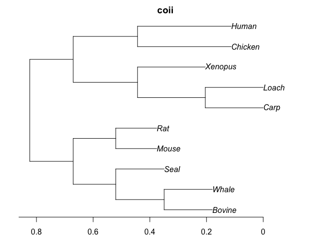
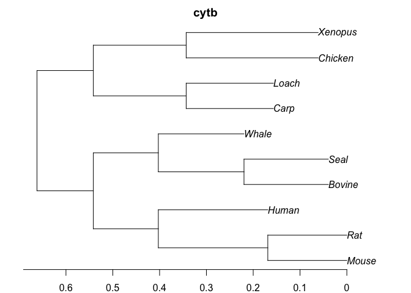
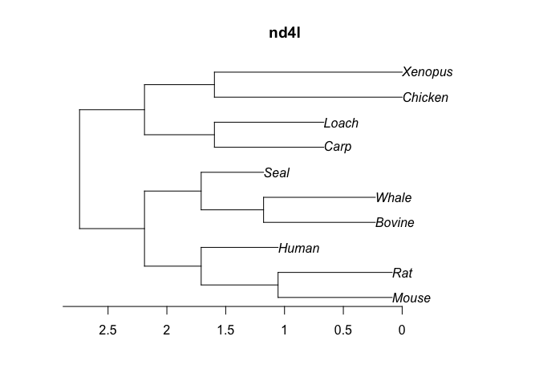

Cummings et al 1995 datasets
================

Let’s test our information theoretic algorithms on the Cummings et al
1995 datasets. Note that a key point of this paper was that individual
genes don’t always reflect the genome tree (or that most phylogenetic
reconstruction algorithms rarely produce the genome tree given aligned
data on one gene). So a priori we shouldn’t expect our algorithms–even
if they usually nail down the right tree–to produce the genome tree on
these datasets.

## Nucleotide Data

1.  Divisive Trees

<!-- --><!-- --><!-- --><!-- --><!-- --><!-- --><!-- --><!-- --><!-- --><!-- --><!-- --><!-- --><!-- -->

<!-- -->

2.  Agglomerative Trees

<!-- --><!-- --><!-- --><!-- --><!-- --><!-- --><!-- --><!-- --><!-- --><!-- --><!-- --><!-- --><!-- -->

<!-- -->

## Codon

1.  Divisive Trees

<!-- --><!-- --><!-- --><!-- --><!-- --><!-- --><!-- --><!-- --><!-- --><!-- --><!-- --><!-- --><!-- -->

<!-- -->
