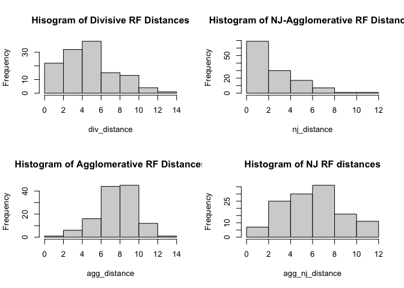
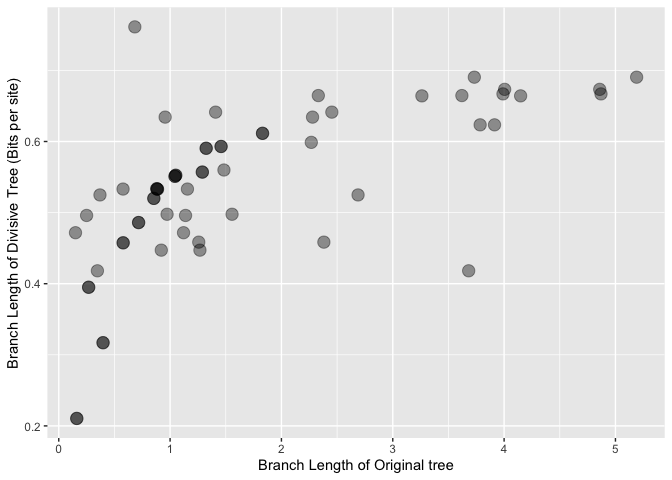
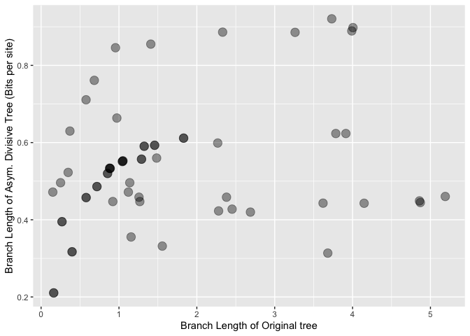
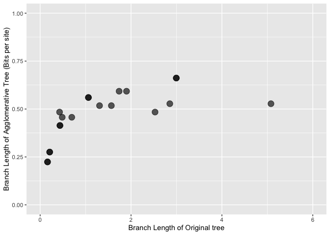
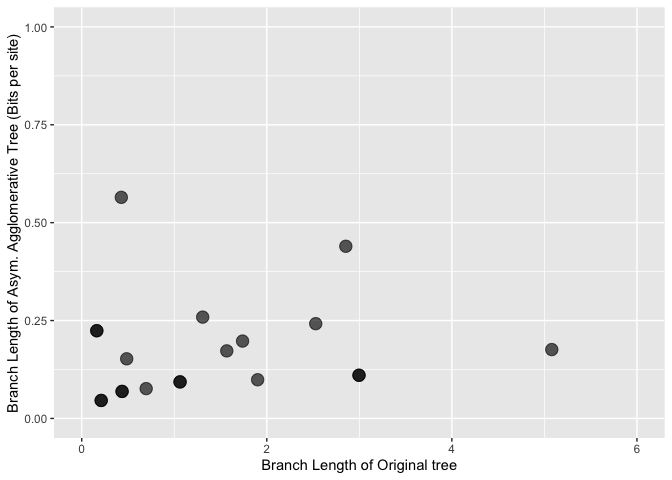
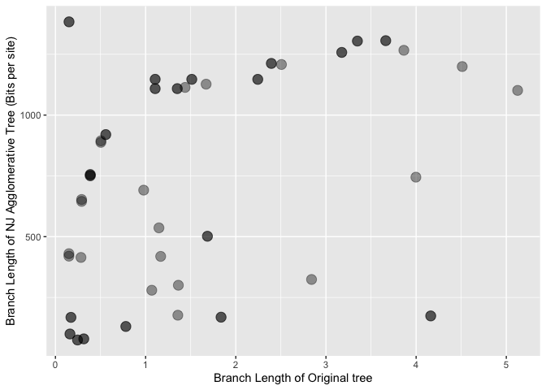

A comparative test of some information theoretic algorithms for
phylogenetic reconstruction
================

# Robinson Foulds distances

    ##          Algorithm Mean RF dist. Prop. of RF = 0
    ## 1         Divisive         5.648           0.024
    ## 2    Agglomerative         8.640           0.008
    ## 3 NJ Agglomerative         6.960           0.016
    ## 4               NJ         3.008           0.248

<!-- -->

# Branch Length Comparisons

1.  Divisive Trees

<!-- -->

## Asymmetric Divisive Trees

<!-- -->

2.  Agglomerative Trees

## Symmetric Agglomerative Trees

    ## Warning: Removed 2 rows containing missing values (geom_point).

<!-- -->

    ## Warning: Removed 2 rows containing missing values (geom_point).

<!-- -->

## Neighbour-Joining agglomerative tree

<!-- -->

3.  Tree properties (ultrametricity, additivity, rooting accuracy)

``` r
print(Tree_data)
```

    ##                  Algorithm Rooting Ultrametricity Additivity
    ## 1                 Original       1              1          1
    ## 2            Agglomerative       0              0          1
    ## 3 Asymmetric Agglomerative       0              0          1
    ## 4         NJ Agglomerative       0              0          1
    ## 5                 Divisive       0              0          1
    ## 6      Asymmetric Divisive       0              0          1
    ## 7                       NJ       0              0          1
