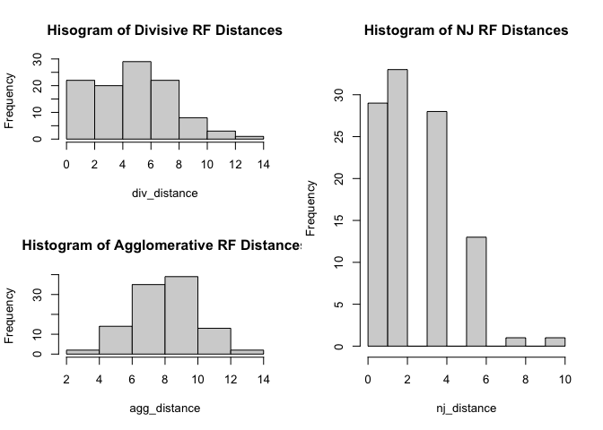
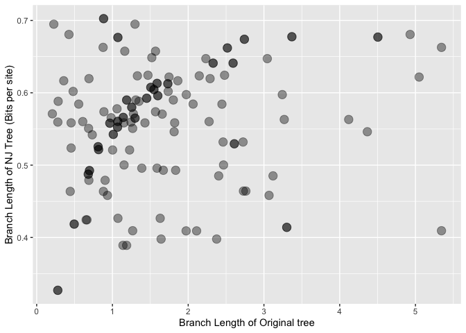

JC69 data with 12 species and 2000 sites
================

We picked 105 samples from a set of 500 randomly generated JC69
sequences with the following parameters:

These samples were found to have a scale ratio (minimum branch length to
mutation) of more than 2.7%, the annealing threshold we picked for
lowering sampling error.

1.  Robinson Foulds distances

<!-- -->

    ##       Algorithm Mean RF dist. Prop. of RF = 0
    ## 1      Divisive      5.619048      0.06666667
    ## 2 Agglomerative      8.971429      0.00000000
    ## 3            NJ      2.609524      0.27619048

<!-- -->

2.  Branch length comparisons

Among the trees computed by our algorithms, only the divisive trees had
a few topologically identical ones

<!-- -->

3.  Tree properties (ultrametricity, additivity, rooting accuracy)

``` r
print(Tree_data)
```

    ##             Algorithm    Rooting Ultrametricity Additivity
    ## 1            Original 1.00000000              1          1
    ## 2            Divisive 0.01904762              0          1
    ## 3 Asymmetric Divisive 0.01904762              0          1
    ## 4       Agglomerative 0.00000000              0          1
    ## 5                  NJ 0.00000000              0          1

Aha! A few divisive trees actually get the rooting right.
