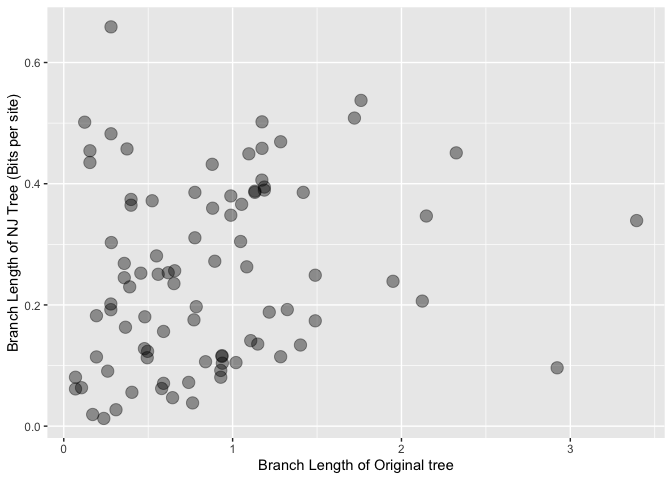

TN93 data with 16 species and 1000 sites
================

We generated a 100 sequences via the `evolver` with TN93 rate parameters
based on the sequences simulated for Cummings et al 2003.

1.  Robinson-Foulds distances

<!-- -->

    ##   Algorithm Mean RF dist. Prop. of RF = 0
    ## 1  Divisive          8.62            0.00
    ## 2        NJ          6.12            0.03

2.  Comparing branch lengths

There are, unfortunately, no divisive trees which had the same topology
as the original ones. But we did have four such NJ trees. We plot the
branch lengths of these trees against the branch lengths of the
corresponding original trees:

<!-- -->

3.  Tree properties (ultrametricity, additivity, rooting accuracy)

``` r
print(Tree_data)
```

    ##             Algorithm Rooting Ultrametricity Additivity
    ## 1            Original       1              1          1
    ## 2            Divisive       0              0          1
    ## 3 Asymmetric Divisive       0              0          1
    ## 4                  NJ       0              0          1
